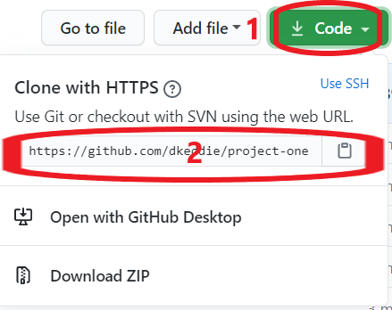
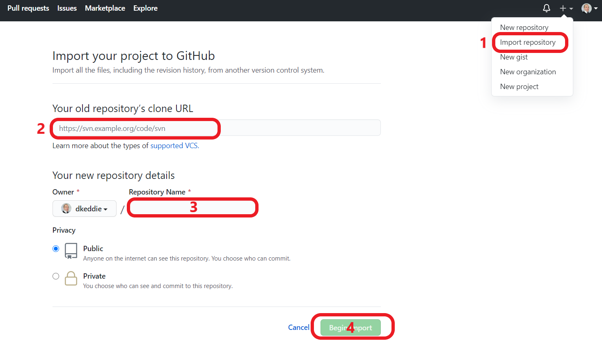

# **MILESTONE PROJECT THREE**

For Milestone Project Three, which requires the development of a full stack site that allows users to manage a common dataset, users can manage the cost tracking of a building development through the design and/or construction phases.  The site allows users to view the current estimated cost and a list of changes which are impacting the cost movement from the original budget.

The website can be viewed [here](https://ms3dkeddie.herokuapp.com/)

## **UX**

### **Who is the Website for?**

Ultimately, the site serves the purpose of the developer, to:-

**1. View the current cost position** 
The website shall enable the developer, and other persons involved and with access, the ability to view the live, current cost position of the development.

Whilst the developer will probably be most interested in the Total Cost, other users may be more interested in the list of changes - and their individual cost impact.

**2. Implement Consistent, Best Practice Cost Control** 
The website shall enable the Cost Managers - those responsible for managing and reporting the current cost position of the development - to report costs immediately as they arise on a project.

The website will provide a consistent approach in the reporting of costs and changes, from project to project.  This will support familiarity and understanding for users.

 

### **User Stories**

On any property development, there will be methods for tracking and reporting costs.  A cost manager will normally implement a simple cost tracker utilising an Excel spreadsheet to list the changes and report this back to the Developer/Client.

I currently work for a developer and we require our cost managers to implement these procedures. The cost managers utilise the Excel cost tracker which can be viewed [here](XXXXXXXXXXX)

My aspiration is to incorporate the principles of this template into a more robust data management system which can be used for different construction projects by different developers / clients.

As such, the fundamentals and principles are crystalised in the User Stories below, which will be translated into the final website.

*As a developer, I want to implement best practice cost control on my construction projects.*

 **Item** | **Experience** | **Objectives**
---------|----------------|---------------
&nbsp; | *As a developer / user, I want to:-* | &nbsp;
1 | Clearly see the current cost position of the project | Provide a Summary that is concise and easy to interpret
2 | Determine the cost movement from start to current/forecast position | Include the original budget, summary of changes and revised total estimate on the Summary
3 | View a full list of the changes impacting the development | Provide a list of the changes on the website
4 | Determine what changes in the latest period (30 days) have added to the revised total estimate | Provide a filter of the cost for the past 30 days
5 | Depending on the purpose of my visit to the site, view only Accepted or Pending/WiP changes | Provide a filter for 'Status' categories
6 | View changes / cost impacts by the type of change to understand their impact on the development | Provide a filter for the 'Change Type' categories
&nbsp; | &nbsp; | &nbsp;
&nbsp; | *As a Cost Manager, I want to:-* | &nbsp;
7 | Add new changes to the Cost Tracker with a breakdown of the cost | Provide an 'Add' function which updates the database and list of changes which can be viewed
8 | Edit changes as details are updated or when the Status changes | Enable an edit function of the change which will update the database

 

### **Functions of the Website**

The functions of the website are to:-

1. Provide a visual summary of the current cost position of the development project.  This is represented in a Dashboard.
    

2.  View a list of all the changes impacting on the cost of a construction project.  This is represented on the Register.
    

3. Ability to Add (create) / View (read) / Edit (update) / Delete changes which affect a construction project.
    

 

___
 

## **Design**

### **Desktop-only** (for now)

The website is optimised for desktops only at this stage, as mobile versions will necessitate a 'lite' version.

Whilst the website / app is in development, the focus is on establishing all the desired functionality of the desktop version in order that there are no constraints are introduced.

Once all the desired features are fully developed, a 'Lite' version will be deployed.
 

### **Key concepts**
The primary purpose of website is to show the current cost of a construction project and a list of the changes that have affected the cost since the establishment of the budget.

The intention of the site is to give this information in a clear, concise manner.  By giving users control of certain filters, it is envisaged that this will assist users understanding of the numbers being presented without the need for explanation.  The filters should give users a better insight on the information and numbers being presented, and in turn control of the project by being able to make more informed decisions.

Whilst the website has reached a point of deployment for presentation, feedback and testing with users, the page requires further development before being deployed in a live situation.

 

### **Wireframe**

Figma was used to develop a key concept into framework for developing the web page / app.  Only a desktop framework was formulated at this stage.

A copy of the original wireframe can be found here: [Figma](https://www.figma.com/file/NCiIRZCyfNSYk62uRwCqu3/MS3?node-id=0%3A1) or [PDF](READMEinfo/Figma.pdf)

 

### Typography

The [Montserrat](https://fonts.google.com/specimen/Montserrat) font (from Google Fonts) is the only font used throughout the whole website with Sans Serif as the fallback font in case for any reason the font isn't being imported into the site correctly.

 

___

## Features

### Interactive Elements

The web page is interactive in the following ways:-

* Filter - on the Dashboard and Register, the Filter acts to filter and change the data presented on screen.
  1. Cost - option to switch between 'Nett' and 'Gross' total figures
  2. Status - selection of Status will update totals or filter the register for only those selected
  3. Change Type - selection of Change Type will update totals or filter the register for only those selected
  4. Period - selecting will update the totals to only include the changes within the period selected.

* Add / Edit Changes - users can add or edit changes, affecting the database accordingly.

* Auto-update input information on the Add / Edit pages:-
  1. Numbers auto-format with thousand separators when fields entered/updated;
  2. Gross total auto-calculates to ensure that it is the sum of the preceding numbers.

### Existing Features

An overview of the features on the website are listed below:

* **Dashboard**: The Dasboard provides a summary of the Cost Position of the project, providing users with a view of the Budget, accepted (Approved) and potential changes (Pending, WiP) and the Revised Estimate.  

  Users can use the Filter to switch between Nett or Gross costs, or include / exclude changes depending on the Status or Change Type.  By enabling users to carry out this function themselves, they will have a deeper understanding of the cost.

  

* **Register**: The Register is a complete list of all Changes stored in the DB.  Like the Dashboard, the Filter will hide from view changes which are not selected.

  By clicking on a row, the Change will open to View/Edit.

  

* **Add Change**: Users can add a change by clicking on the '+' button on the Register page, which will bring them to this input page.

  The dates auto-populate to the current date and are not editable.  The Gross Cost also auto-calculates, and is the sum of the Nett Cost, Contingencies and Main Contractor On-Costs.  This ensures that there is no manual error in the calculation.

  

* **View / Edit Change**: Users can View/Edit a change by clicking on the row on the Register, which will bring them to this page.

  On load, the input fields are Read Only, but on clicking the 'Edit' button, the editable fields will become active.

  A delete button is also included on this page.  Deletion is permanent and therefore a warning pop-up is utilised to confirm the action before committing.

  

* **Budget**: This page allows users to amend the Approved Budget.

  

* **Registration**: This page allows users to Register for access to the web page.

  

* **Log In**

  

* **Log Out**: Removes all session cookies and ensures that pages / APIs cannot be accessed when not logged in.

  

### Features to Implement in the Future

The functions implemented on this website are for demonstration purposes only at this stage, there is further development required before the website can be deployed for a live development.  Those features required before live deployment include:-

* **Authorisation of Registration:** After a user has registered, access will not be granted until an Administrator approves access and sets privileges.
* **Access privileges:** Users will be granted different rights and viewer privileges dependent upon their role on the project. For example, a cost manager will be able to add and edit changes, whereas other users will only be able to view them.  An Adminstrator role will also be introduced for controlling these access privileges.
* **Graphical Representation:** To enhance and make the user experience more engaging, the Dashboard can benefit from graphs or other figurative representations of the data in a more visually absorbing way.

 

## Technologies Used

### Languages Used

* [HTML5](https://en.wikipedia.org/wiki/HTML5)
* [CSS](https://en.wikipedia.org/wiki/Cascading_Style_Sheets) 
* [Javascript](https://en.wikipedia.org/wiki/JavaScript)
* [Python](https://www.python.org/)

### Frameworks, Libraries and Programmes Used 

* [MaterializeCSS](https://materializecss.com/)  
Materialize is generally used to assist with the layout, utilising the in-built grid system, and design functionality.

* [Google fonts](https://fonts.google.com/)  
Google fonts is used to import the 'Montserrat' font into the style.css file which is used throughout the project.

* [jQuery, incl UI](https://jquery.com/)  
jQuery is used for Javascript DOM manipulation.

* [Git](https://git-scm.com/)  
Git was used for version control by utilizing the terminal in VSCode terminal to commit and push changes to GitHub.  
In addition, in order to track the purpose of commits, the following pre-fixes have been adopted, which are taken from the Commit Message Guidelines outlined by [Angular Framework](https://github.com/angular/angular/blob/22b96b9/CONTRIBUTING.md#-commit-message-guidelines):-
  * feat: new feature has been added to the code
  * fix: bug fixed during on-going testing
  * refactor: 'tidy up' of code
  * docs: addition of comments to code or writing of README file

* [GitHub](https://github.com/)  
GitHub is used to store the projects code after being pushed from Git.

* [Heroku](https://www.heroku.com/)  
Heroku is used for deployment of the website / application.

* [Figma](https://www.figma.com/)  
Figma was used to create the wireframes during the design process.

* [Screen Recorder](https://chrome.google.com/webstore/detail/screen-recorder/hniebljpgcogalllopnjokppmgbhaden)  
Screen Recorder used for creating videos (edited in Kapwing) of website features in operation.

## Testing

### User Story Feedback and Testing

**1** | **Clearly see the current cost position of the project**
---------|----------------
**2** | **Determine the cost movement from start (budget) to current / forecast position**
(a) | Users can view the current cost position of the project on the Dashboard, including the Approved Budget and the Revised Estimate
(b) | Users can see the build-up to the Revised Estimate, so they know what changes are included in it
(c) | By switching the Nett and Gross Cost filter, users can be sure they know the basis of the cost.
(d) | 
________________

 

**3** | **View a full list of the changes impacting the development**
---------|----------------
**4** | **Determine what changes in the latest period (30 days) have added to the revised total estimate**
(a) | The Register has a list of all changes being recorded on the project
(b) | As users will be particularly interested in 'new' or 'updated' changes, the Register can be filtered accordingly to show only those 'new' or 'updated' changes within the last 30 days.
(c) |
_____________

 

**5** | **Depending on the purpose of my visit to the site, view only Accepted / Pending / WiP changes**
---------|----------------
**6** | **View changes / cost impacts by the type of change to understand their impact on the development**
(a) | On the Dashboard, the Filter can be used to show only those costs which are Selected.  This may be useful where, for example, a Client only wishes to know their *committed* costs, I the budget and those changes which are approved.  As such, Pending and WiP changes would not be included in the Revised Estimate and would be unchecked.
(b) | 
(c) | Similarly on the Register, the Filter can be used in a similar way.  For example, a Client may wish to review only thos Pending changes for authorisation / acceptance.
(d) | 
_____________

 

**6** | **Add new changes to the Cost Tracker with a breakdown of the cost**
---------|----------------
(a) | New changes may be added to the DB with a breakdown of the Cost.
(b) | 
_____________

 

**7** | **Edit changes as details are updated or when the Status of a change is made**
---------|----------------
(a) | Changes listed on the Register can be made by clicking on the row to View / Edit the item
(b) |  
____________

 

### Validators

The W3C Markup Validator and W3C CSS Validator Services were used to validate the main pages of the project to ensure there were no syntax errors in the project.

**[W3C Markup Validator](https://validator.w3.org/)**

In order to check the HTML, the code was copied by 'Text Input' on the validator, as the code is not passed and checked by the 'Address' method.  There are no outstanding errors - screen captures of the results are shown on the links below.

**Results**
  - Dashboard
  
  - Register
  
  - Add Change
  
  - Edit Change
  

 

**[W3C CSS Validator](https://jigsaw.w3.org/css-validator/)** - [Results]("https://jigsaw.w3.org/css-validator/validator?uri=https%3A%2F%2Fms3dkeddie.herokuapp.com%2Fstatic%2Fcss%2Fstyle.css&profile=css3svg&usermedium=all&warning=1&vextwarning=&lang=en")

There are no errors highlighted by the CSS validator.
 
 

### Javascript Code Quality - JSHint

[JSHint](https://jshint.com/) has been used to check and test the Code Quality of the Javascript used on this page.  The Javascript has been updated in line with warnings initially returned.  The following items remain and which are deemed not critical to the functioning of the site:-

- Where warnings of ES6, 8 and 10 have been raised, these have not been ignored, as the main browsers will function with the use of this version of Javascript.
- There remains one warning, 'Redefinition of 'origin'', hover this is an intended part of the Javascript to be implemented on the page.
- Undefined variables - these are undefined on the initial page load but become defined after further Javascript has been implemented.
- Unused variables - these variables are required for the running of external APIs.
 

### Python compliance with PEP8

[PEP8 online](http://pep8online.com/) has been used to check compliance of the app.py file used in this application with PEP8 requirements.  The file was updated in line with non-compliance results that were initally returned.

There are no non-compliance remaining in the app.py file.

### Manual Testing of the Site

The following tests were carried out to ensure functionality before deployment:-

**Test**: Changes can be added and filtered for each Status and Change Type
* Steps followed:
  * Add a change which correlates to each Status/Change Type option (ie 4 x 6 = 24 changes)
  * Rotate through each status and change type to add a change
  * Check Dashboard and Register functions for each Status and Change Type on the Filter
* Results:  Dashboard and Register load as anticipated, with Status and Change Type filter operating to include / exclude applicable changes in the Totals on the Dashboard and list of changes on the Register.

**Test**: Test the Period Filter
* Steps followed:-
  1. Manually amend two Changes in the MongoDB collection, one for the 'date_added' field and the other for the 'date_changed' field.  The dates should be one year earlier than the current date, ie more than 30 days ago.
  2. Check the dates have been updated on the website / Register by selecting each item in turn and clicking the item to View.
  3. Return to the Register and select the Period filters to check that the Filter operates as intended
* Results:-
  * The period filter operated as expected, but removing the Changes with dates outwith the 30 day period.

During the on-going testing and development of the site, bugs were discovered and resolved.  These can be reviewed in the list of Git commits, specifically those with the 'fix' prefix.

For a list of the Git Commit history, this can be viewed [here](https://github.com/dkeddie/MS2/commits/master)

### Further Testing

During the development of the website, and again as a final, comprehensive and in-depth review, the following testing was carried out:-

* The Website was tested on Google Chrome, Internet Explorer, Microsoft Edge and Safari browsers.
* The website was viewed on a variety of devices: Desktop, Laptop, iPad.
* Buttons were checked to ensure when hovered or active that they are responsive and operate uniformly.

### Known Bugs

The following issues were identified during development of the site.  Some of them have been fixed during the final checking, testing and deployment phase:-

1. 
2. 
3. 

## Deployment

### For Development Purposes

The website has been deployed on GitHub and is currently publicly accessible. 

The development of the website has been undertaken on VSCode.

The steps from start to present were:-

**Connection to GitHub repository**

  1. Creation of repository on GitHub, utilising Code Institute template.

  2. Clone of GitHub repository to local machine but utilising GitBash to implement the command:-  
  `git clone https://github.com/dkeddie/MS3.git`

**Deployment to Heroku**

  3. Creation of a new App on Heroku
  4. Go to 'Deployment Method' -> Select 'GitHub' and search for the repository that you want to deploy via Heroku from GitHub.
  
  5. Go to 'Settings' and 'Reveal Config Vars' -> Input the settings required to deploy the website and connect to the Mongo Database as shown below ()
  
  
  6. Go to 'Deploy' and select to Enable Automatic Deploys
  

The website is now deployed and can be viewed at:
    [https://ms3dkeddie.herokuapp.com/](https://ms3dkeddie.herokuapp.com/)  
 

### Cloning of the Repository

Should you wish to deploy your own version of the website, the following steps may be followed to host your own version on GitHub:-

1. Visit my GitHub Repository: [MS3](https://github.com/dkeddie/MS3)

2. Click dropdown 'Code' and copy url to 'Clone with HTTPS'  

3. Select 'Import Repository' from the Menu dropdown, paste the url, give your new repository a name and click 'Begin Import'

4. Go to your new Repository.  You may chose to launch the repository in an IDE of your chosing in order to make changes to the website, and customise it to your requirements.

5. To deploy the website, follow step 3 of the **Deployment** section immediately above.

## Credits

### Content

All content and code was written by the developer, except where taken from libraries or documented within this file or the Code files.

### Acknowledgements

Thank you to my mentor for feedback and advice given throughout the project.